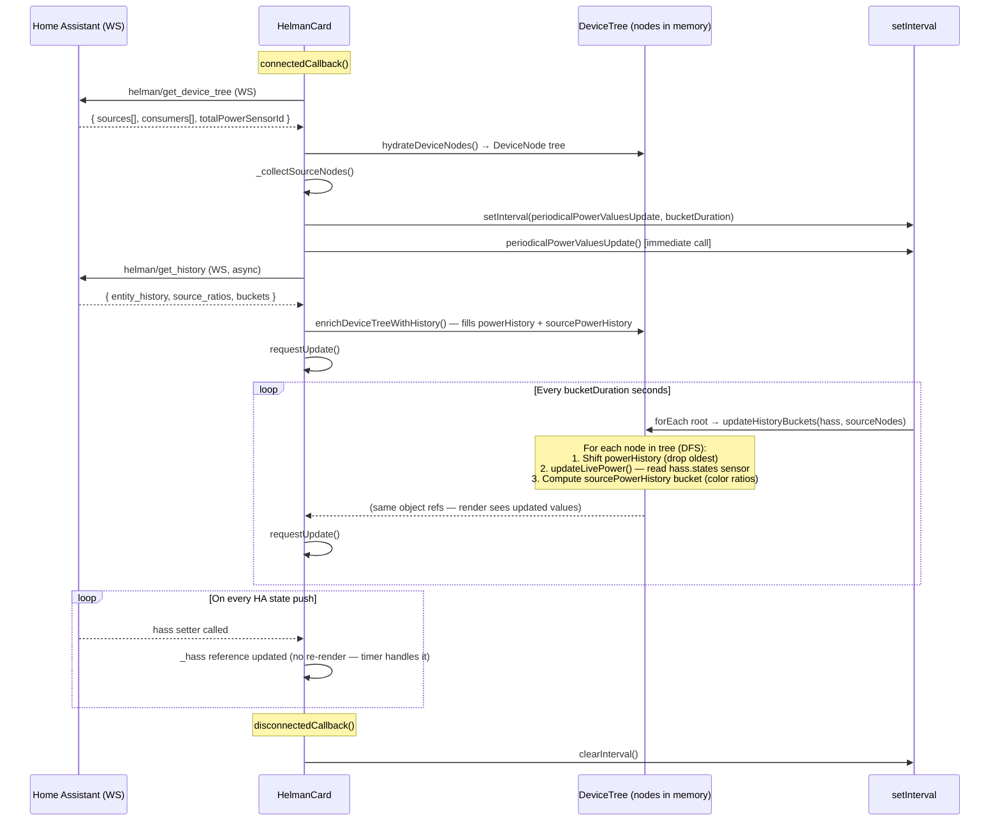

# Helman Card — Data Flow & Lifecycle

## Short Answer: Timer & Push

There is **one shared `setInterval` timer** in `HelmanCard` (the root card component).
No node pulls its own data — all nodes are updated in a single synchronised tree walk triggered by that timer.
Additionally, HA pushes state changes via the `hass` setter, which triggers an immediate re-render (but **not** a bucket advance).

---

## Lifecycle Diagram

---

## Data Flow Table

| Phase | Trigger | What happens | Single or per-node? |
|---|---|---|---|
| **1. Tree fetch** | `connectedCallback` | `helman/get_device_tree` WS call → backend returns full tree DTO; `hydrateDeviceNodes` builds `DeviceNode` objects | Single call, once |
| **2. Source node cache** | After tree fetch | `_collectSourceNodes` walks the tree and caches all `isSource` nodes in `_sourceNodes` | Single walk, once |
| **3. History fetch** | After tree fetch, async | `helman/get_history` WS call → backend returns pre-bucketed `entity_history` + `source_ratios`; `enrichDeviceTreeWithHistory` fills `powerHistory` and `sourcePowerHistory` on every node | Single call, once |
| **4. Bucket timer tick** | `setInterval` every `history_bucket_duration` s | `periodicalPowerValuesUpdate` walks the whole tree via `updateHistoryBuckets` (DFS): shifts history arrays, reads current sensor value from `hass.states`, recomputes `sourcePowerHistory` live bucket | **Single timer, entire tree** |
| **5. Live sensor push** | HA calls `hass` setter | `_hass` reference is updated silently — no re-render, no tree walk. The next timer tick picks up the new values from `hass.states` | Reference update only |
| **6. Node coloring (live)** | Inside step 4, per node | `updateLivePower` distributes total power across source nodes by ratio and writes the colored `sourcePowerHistory` last-bucket entry | Per-node inside timer walk |
| **7. Grouping / virtualisation** | `power-house-devices-section` render | Label-category group nodes are synthesised from house children; their `powerHistory` and `sourcePowerHistory` are aggregated from children at render time | Per-render, in component |
| **8. Disconnect** | `disconnectedCallback` | `clearInterval` stops the timer | — |

---

## Key Design Points

- **No per-node timer.** All periodic work is orchestrated by the single `setInterval` in `HelmanCard`.
- **History arrays are mutated in place.** `updateHistoryBuckets` shifts and appends on the existing arrays; `render()` reads the same object references, so Lit re-renders without re-building the tree.
- **`_sourceNodes` is a stable cache.** It is only rebuilt when `_deviceTree` is replaced (after a fresh fetch), not on every tick — keeping the timer callback allocation-free.
- **Backend does the heavy lifting.** History fetch (`helman/get_history`) returns pre-bucketed data including per-source power ratios, so the FE only needs simple per-bucket aggregation.
- **`sourcePowerHistory` drives bar coloring.** Each history bar segment reads `sourcePowerHistory[i]` — a map of `sourceNodeId → { power, color }` — computed both from backend history (step 3) and continuously updated by the live timer (step 4).
